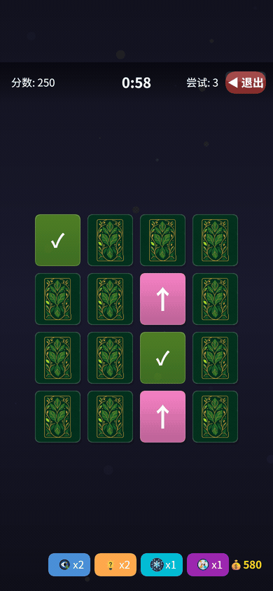
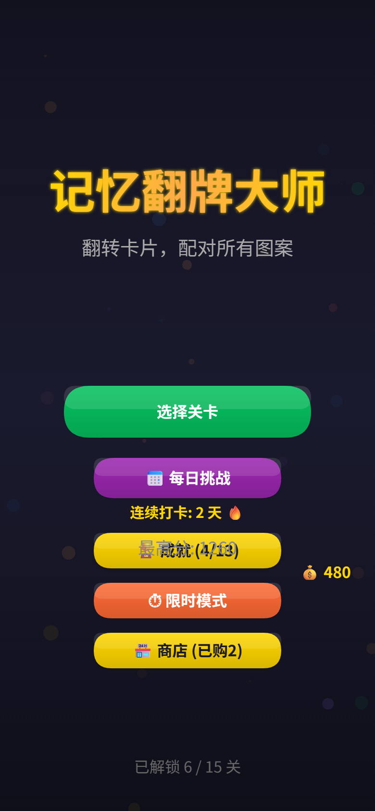
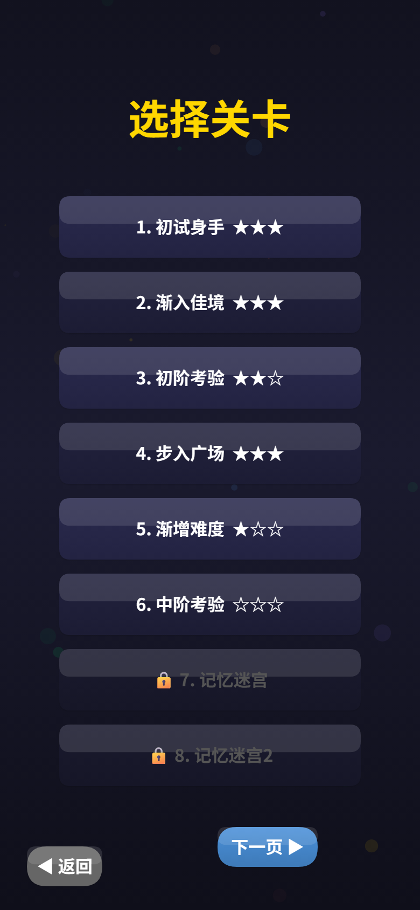
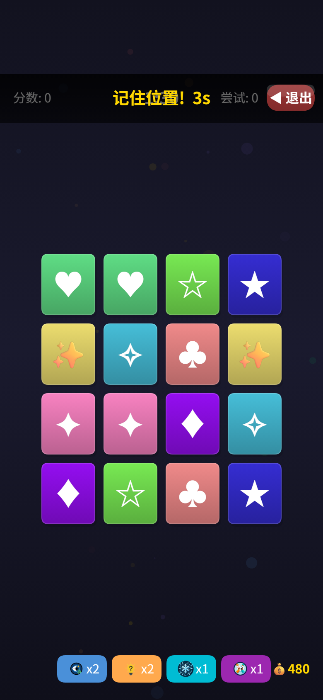
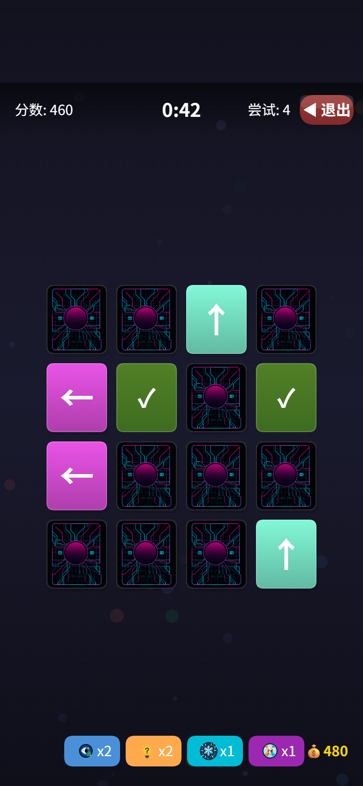
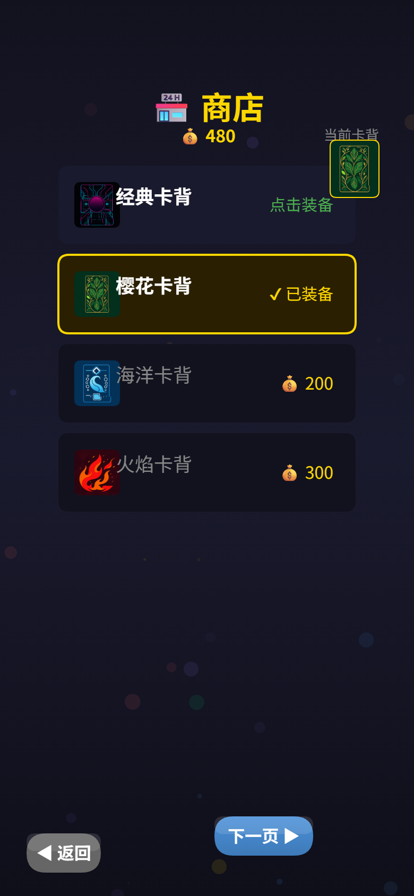
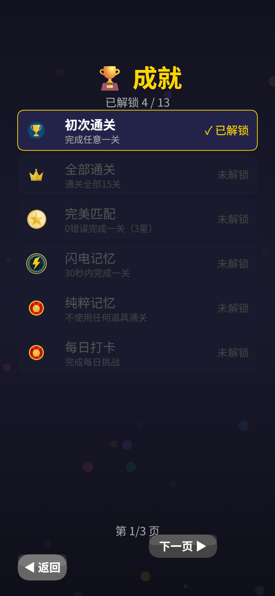
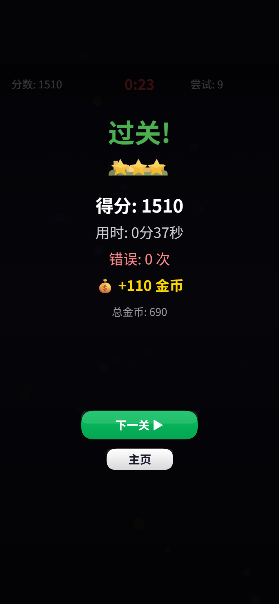

# 记忆翻牌大师

> **这是一个 Demo，已完成，暂不维护。**
> 做给家里人玩的微信小游戏，够用就好。不加音效、不加难度、不加广告道具。
> 想自己改着玩随便改，改坏了也没关系——原版在这儿。

微信小游戏 · 单文件 `game.js` + Canvas 2D 渲染 · 无第三方依赖 · 无游戏引擎 · 无场景文件

标签：`v0.1.0-demo` ｜ 平台：微信小游戏 ｜ 状态：功能完成，停止迭代

---

## 目录

- [先看这里：项目类型必须是「小游戏」](#先看这里项目类型必须是小游戏)
- [怎么跑起来](#怎么跑起来)
- [玩法](#玩法)
- [界面长什么样](#界面长什么样)
- [已知限制](#已知限制)
- [代码结构](#代码结构)
- [仓库里的其他东西](#仓库里的其他东西)
- [想重新生成截图](#想重新生成截图)

---

## 先看这里：项目类型必须是「小游戏」

这是最容易踩的坑，也是唯一会让你「导入就报错」的地方。

本项目是**微信小游戏**（入口 `game.js` + 配置 `game.json`），**不是小程序**。
小游戏项目**没有 `app.json`**。如果按小程序导入，开发者工具会报：

```
Error: app.json: 在项目根目录未找到 app.json
```

`project.config.json` 里必须满足：

```json
"compileType": "game"
```

**不要**找 `miniprogramRoot` 字段——那是小程序专用，小游戏不需要。

---

## 怎么跑起来

需要装**微信开发者工具**（Windows / macOS 都有）。

1. 下载或克隆本仓库。
2. 打开**微信开发者工具** → **导入项目**。
3. 项目类型选 **「小游戏」**——不是「小程序」，这一条选错后面全错。
4. AppID 点「**使用测试号**」。仓库里的 `project.config.json` 已经写的是 `touristappid`（测试号），直接用就行，不需要你有自己的 AppID。
5. 目录选仓库根目录（就是有 `game.js` 和 `game.json` 的那一层）。
6. 导入后打开 `project.config.json`，确认 `"compileType": "game"`。
7. 点「**编译**」，模拟器里就能玩了。

### 怎么在手机上玩

想给家里人装到手机上：

1. 在开发者工具里点「**预览**」，用微信扫那个二维码。
   注意：会弹警告说「测试号不能预览」，点确认继续就行，扫描的人需要是项目的体验成员。
2. 已经有正式 AppID 的话，把 `project.config.json` 里的 `appid` 换成你自己的，再点上传。

> **⚠️ 但现在还传不上去 —— 上传前必须先压缩图片。**
>
> 微信小游戏的限制是**首包 4MB、全部代码包合计 30MB**。这个项目运行时需要的资源
> （`images/clean/` 里 24 个文件）加起来是 **33MB**，已经超了，开发者工具会拒绝上传。
>
> 原因很直白：资源图全是 **1024×1024 的 PNG**，每个 1~1.6MB。但卡片在屏幕上根本用不到这么大——
> 最宽的 4×4 关卡下卡片只显示 **65×74 逻辑像素**，即使在 DPR=3 的旗舰机上也就 **195×222 实际像素**。
> 也就是说 1024px 的图里有 80% 以上的像素永远不会被看到。
>
> **怎么解决**：把 `images/clean/` 下的 PNG 缩到实际需要的大小再重新上传。
> 缩到 512×512 就够覆盖 DPR=3 的所有场景，体积能降到 1/4，合计约 8MB，轻松过审。
> 这一步没有做成，因为压缩图片属于「改资源」，超出了本次定稿的范围——
> 但**不知道这件事就上传会浪费时间**，所以写在这里。
>
> `project.config.json` 的 `packOptions.ignore` 已经配好了，会排除掉
> `legacy/` `docs/` `tools/` 和 `images/` 下的四套原始源图（那 30MB 才是大头里的另一块）。
> 配完之后打包体积从 73MB 降到 33MB，剩下的就只差图片压缩这一步。

### 导入报错了怎么办

| 现象 | 原因 | 怎么办 |
| --- | --- | --- |
| `app.json: 在项目根目录未找到 app.json` | 按「小程序」导入了 | 重新导入，类型选「小游戏」 |
| 打开是黑屏 | `compileType` 不是 `game` | 改 `project.config.json` 后重开项目 |
| 目录选错 | 选到了 `legacy/` 或子目录 | 目录要选含 `game.js` 的那一层 |
| 图片全空 | 没等资源加载完 | 编译后等一两秒，要逐个加载 30 个资源条目 |
| 点上传报「包体积超限」 | 资源图没压缩，33MB 超了 30MB 上限 | 见[「怎么在手机上玩」](#怎么在手机上玩)里的说明，先缩图 |

---

## 玩法

一句话：翻两张牌，图案一样就配对消掉，把一关的牌全消完。

### 一局的流程

1. **记忆阶段**：开局全部牌面朝上，记住图案位置。倒计时按关卡配置走（1.0~2.5 秒）。
2. **翻回**：牌全部盖回去，开始计时。
3. **配对**：点两张牌。图案一样 → 消掉、加分、+连击；不一样 → 翻回去、失误 +1。
4. **结束**：全部配对完成，或倒计时归零。通关按用时和失误评 1~3 星。

### 得分

```
单次配对 = 100 + min(连击数 × 10, 50)
通关额外奖励 = 剩余秒数 × 10
```

连击断了就从头来，所以尽量一口气连着配。

### 三星标准

| 条件 | 结果 |
| --- | --- |
| 0 失误 | 直接三星 |
| 分数 ≥ 关门卡第一档分数线 | 三星 |
| 分数 ≥ 第二档分数线 | 两星 |
| 其他 | 一星 |

### 15 个关卡

难度靠三样东西往上走：**牌更多**（4×4 → 6×6）、**时间更紧**（90 秒 → 200 秒，但牌也更多了）、**图案主题每 3 关换一次**（星光 → 几何 → 箭头 → 数学 → 自然 → 音乐）。

关卡必须**按顺序解锁**，上一关拿到星才能开下一关。

### 四种玩法

| 玩法 | 规则 |
| --- | --- |
| **关卡模式** | 15 关，通关拿星、解锁下一关 |
| **每日挑战** | 每天按日期生成一个固定关卡，全天所有人一样。连续打卡 3 / 7 天有额外金币 |
| **限时模式** | 90 秒，4×4 牌，消完自动重建棋盘继续，看能配多少对 |
| **商店 / 成就** | 金币买卡背皮肤（7 种），13 个成就 |

### 四个道具

每关开局白送（偷看 / 提示 高难度关给 3 次，冻结从第 8 关起给 2 次，洗牌固定 1 次）。

| 道具 | 效果 |
| --- | --- |
| 🔍 **偷看** | 短暂亮出所有牌 |
| 💡 **提示** | 高亮一对可配对的牌 |
| ⏱️ **冻结** | 倒计时暂停几秒 |
| 🔄 **洗牌** | 重新打乱未配对的牌 |

第一次用每个道具都会弹一次教学弹窗，教完不会再弹。

### 成就（13 个）

初次通关、全部通关、完美匹配、闪电记忆、纯粹记忆、每日打卡、连续三天、一周坚持、道具大师、记忆新秀、记忆高手、连击达人、限时达人。

### 金币

通关拿金币（`10 × 关卡编号`，按星级再加 10/20/50），每日打卡连续 3/7 天额外给 100/300。金币存本地，用来买卡背皮肤。

---

## 界面长什么样

<p align="center">
  
</p>

<p align="center">
  
  
  
  
  <br>
  
  
  
  
</p>

上面这些图**不是画的示意图**，是把真实的 `game.js` 塞进浏览器无头 Chromium 跑起来截的。`tools/preview/` 里有完整工装，见[文末](#想重新生成截图)。

---

## 已知限制

先说清楚这个 Demo 做到了什么、没做到什么。

### 架构上的债

- **单文件 2611 行。** 全部逻辑塞在 `game.js` 里，`handleTap()` 一个函数占了 253 行（2340~2592），所有点击分发都在里面。改东西之前先搜一下函数名，做好心理准备。
- **`render()` 每帧全量重绘。** 没有脏矩形、没有离屏缓存。手机低端机上帧率会掉，但 Demo 阶段没优化。
- **之前尝试过分层重构，失败了。** `legacy/js/engine.js` 文件末尾只有一行注释 `// Export`，**缺 `module.exports`**，而 `legacy/js/ui.js` 依赖 `require('./engine.js')` 取 `state`——直接切过去会崩。`legacy/game.refactored.js` 也只 require 了 `config.js` 和 `audio.js`，没接 engine / ui / util，同样是残缺的。**这些代码已移到 `legacy/`，不要试图接回来**，要重构就从 `game.js` 重新切。

### 资源

- 卡片背景、图标、成就图、结算装饰共 **27 个 PNG**，全在 `images/clean/`。`game.js` 的 `ASSET_PATHS` 里有 **30 个条目**，指向 **24 个不同的文件**（有 4 个成就图标被复用了）。
- `images/clean/icons/` 里的 `home.png` / `play.png` / `retry.png` **没有被引用**（早期设计的残留）。
- `images/` 根下的 `cardbacks/` `icons/` `achievements/` `settlement/` 是**原始带水印的源图**，运行时不用，只有 `clean/` 生效。
- 图片加载失败会退化成 emoji 或纯色方块，不会白屏，但会明显难看。
- 图标里的 🀄 🃏 💡 ⏱ 🔄 等是 Unicode emoji，**不同手机上长得不一样**。
- **资源图分辨率严重超标，导致上传超限。** `images/clean/` 里每个 PNG 都是 **1024×1024**、1~1.6MB，24 个文件合计 **33MB**。但卡片实际显示只有 65×74 逻辑像素（@DPR=3 也才 195×222）——**80% 以上的像素永远不会被看到**。微信小游戏首包上限 4MB、代码包合计 30MB，所以**这个状态上传会被拒绝**。缩到 512×512 即可解决（合计约 8MB），详见[「怎么在手机上玩」](#怎么在手机上玩)。

### 功能边界

- **没有音效和背景音乐。** `game.js` 里有个 `AudioManager`，是程序化合成音（用 WebAudio 振荡器，零音频文件），但**默认静音**（`musicOn: false`），只有 `sfxOn: true`。而且它依赖 `wx.createWebAudioContext()`（基础库 2.28.0+），在浏览器预览工装里我故意没实现这个 API，音频会走降级分支变静音——**所以那些音效代码实际从没被验证过**。想启用得自己接音频文件。
- **没有广告、没有内购、没有排行榜后端。** `uploadScore()` 调了 `wx.setUserCloudStorage()` 但没有服务端，**分数只存在本地，谁也看不到**。分享也只是本地生成分享卡，不走真实转发。
- **没有云存档。** 进度、金币、成就全在 `wx.setStorageSync` 本地。换手机、清理缓存、重新编译，全没了。
- **没有广告道具。** 只有 4 个游戏内道具，不看广告。
- **难度固定。** 15 关写死在 `game.js` 的 `LEVELS` 数组里，没有 4×4 / 4×5 / 4×6 的难度选择。
- **没有暂停 / 存档续玩。** 关卡内退出，这一局就没了。
- **没有防作弊。** 限时模式的时间、金币、分数全在客户端变量里，改内存就能改。
- **切后台没有暂停。** `wx.onHide` 只停 BGM、`wx.onShow` 恢复音乐，游戏计时照跑。

### 兼容性

- 需要**竖屏**。`game.json` 锁了 `deviceOrientation: portrait`，横屏布局会错。
- 首次进入有**新手引导弹窗**，教四个道具各一次。
- 隐藏了状态栏（`showStatusBar: false`），刘海区域靠 `safeArea.top` 避让。

### 明确不做

音效、难度选择、广告道具、排行榜、云存档、防作弊——**这些都不是这个 Demo 的一部分**。想加就自己 fork 改，改坏了原版还在。

---

## 代码结构

```
MemoryCardGame/                      ← 仓库根目录
├── game.js                          ← 唯一入口，全部游戏逻辑（2611 行）
├── game.json                        ← 小游戏配置（竖屏、隐藏状态栏、5秒网络超时）
├── project.config.json              ← 项目配置（compileType 必须是 game；packOptions.ignore 已排除 legacy/docs/tools/源图）
├── project.private.config.json      ← 开发者工具私有配置（已 gitignore）
│
├── images/
│   ├── clean/                       ← 实际生效的资源（27 个 PNG）
│   │   ├── cardbacks/               ← 7 张卡背
│   │   ├── icons/                   ← 8 个图标（3 个未被引用）
│   │   ├── achievements/            ← 7 个成就图标
│   │   └── settlement/              ← 5 个结算装饰
│   ├── cardbacks/                   ← 原始源图（未使用）
│   ├── icons/                       ← 原始源图（未使用）
│   ├── achievements/                ← 原始源图（未使用）
│   └── settlement/                  ← 原始源图（未使用）
│
├── docs/
│   ├── 微信小游戏架构设计.html
│   ├── 游戏设计文档_v2.html
│   ├── 音频系统设计文档.html
│   └── screenshots/                 ← 截图与 GIF（本文档用）
│
├── tools/preview/                   ← 截图工装（不参与小游戏打包）
│   ├── index.html                   ← wx API 的浏览器垫片
│   └── capture.mjs                  ← 无头 Chromium 截图脚本
│
├── HANDOFF.md                       ← 开发交接记录
└── legacy/                          ← 历史遗留，不参与运行，别接回去
    ├── js/                          ← 未完成的分层重构（缺 module.exports）
    ├── game.refactored.js           ← 残缺的重构入口
    ├── game.js.bak2                 ← 旧备份
    ├── game_tagged.js / game_temp.js
    ├── extract_layers_v3/v4/v5.py   ← 分层拆分脚本（v5 有 bug）
    ├── extract-layers.js
    ├── refactor.js / refactor-v2.js ← 早期重构尝试
    ├── audio_manager.js             ← 早期音频尝试
    ├── build.js                     ← 音频模块打包脚本
    └── fix-shop-handler.js          ← 修 bug 的一次性脚本
```

**要改游戏，只看 `game.js` 和 `images/clean/`。其他都可以当作不存在。**

`game.js` 里的关键位置：

| 位置 | 内容 |
| --- | --- |
| `LEVELS` | 15 关配置（行数、列数、时间、预览时长、配色、星级分数线） |
| `SHOP_ITEMS` | 8 个商品（7 张卡背 + 1 个成就框） |
| `ACHIEVEMENTS` | 13 个成就 |
| `SYMBOLS` | 60 个符号，按 6 个主题分组，每 3 关换一次 |
| `createBoard()` | 生成棋盘、洗牌、分配不重复符号 |
| `checkMatch()` | 配对判定、得分、连击、粒子、飘字 |
| `gameOver()` | 结算、星级、金币、成就检测 |
| `handleTap()` | **最长的函数**，所有点击分发 |
| `render()` | 场景分发 + 每帧全量重绘 |

---

## 仓库里的其他东西

- **`HANDOFF.md`** — 开发过程的交接记录，踩过的坑、修过的问题都在里面。想知道「为什么长成这样」先看它。
- **`docs/*.html`** — 三份设计文档。写的是**当时设想**，跟代码不完全一致（比如音频设计文档里描述的东西最终没接进去）。当参考，别当规格。
- **`legacy/`** — 历史遗留，git 历史完整保留，需要时能翻回去。
- **`tools/preview/`** — 截图工装，见下。

---

## 想重新生成截图

`docs/screenshots/` 里的图和 GIF 都是自动生成的，改了游戏想更新截图就重跑一遍。

需要 **Node 22+**（自带 `WebSocket` 和 `fetch`，不用 `npm install`）和本机任意 Chromium / Chrome / Edge，以及 `ffmpeg`（只用来合成 GIF）。

```bash
# 在仓库根目录执行（Windows 路径）
"C:\Users\34759\.workbuddy\binaries\node\versions\22.22.2-3\node.exe" tools\preview\capture.mjs
```

它会：

1. 起一个本地静态服务器，用无头 Chromium 打开 `tools/preview/index.html`。
2. 那个 HTML 里有一层 `wx` API 的浏览器实现（`wx.createCanvas` → `<canvas>`，`wx.getStorageSync` → 内存 store，触摸 / 分享 / 震动 → 空实现，不提供 `wx.createWebAudioContext` 所以音频走静音降级）。
3. 等 `game.js` 真实执行、资源真实加载完（30 张图），然后改 `state.phase` 逐个场景切画面截图。
4. GIF 用的是**真实交互链路**：`__tap()` 触发 `wx.onTouchStart` / `onTouchEnd` → 走 `handleTap()` → `onCardClick()` → 350ms 后 `checkMatch()` 真实触发粒子和飘字，逐帧导出后交给 ffmpeg。
5. 输出到 `docs/screenshots/`。

工装里有两处**手动时钟**（`__setTime` / `__step`），因为 `game.js` 的粒子、飘字、连击动画全靠 `Date.now()` 算进度，不做虚拟时钟就没法逐帧复现。另有 `__freeze()` 用来清掉 `setTimeout` 驱动的流程，避免真实时间在截图途中改变画面。

改了游戏想加新场景，编辑 `tools/preview/capture.mjs` 里的 `SCENES` 数组，照现有格式加一条 `setup` 就行。

---

## 许可

代码和资源随便用、随便改、随便拿去玩。
